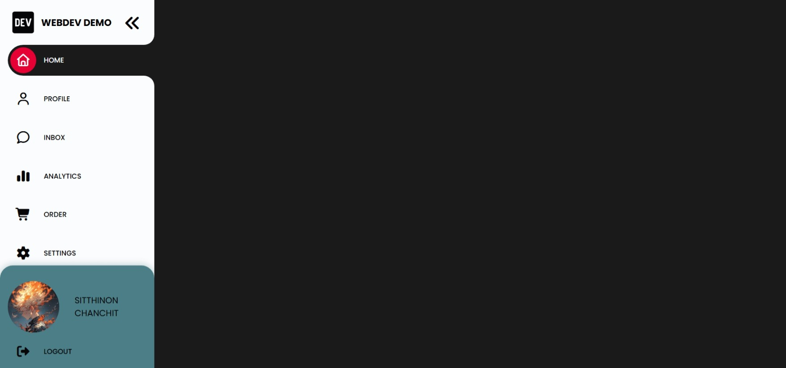
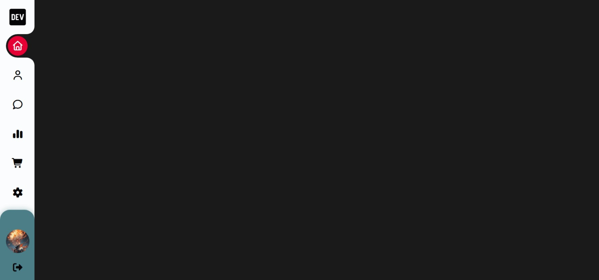

# 🌀 Curve Sidebar Navigation

> _A modern curved sidebar UI with multi-color glow accents — built purely with HTML, CSS, and JavaScript._

A **sleek and interactive sidebar navigation UI** featuring a **curved active highlight**, dynamic **color themes per menu**, and smooth expand/collapse transitions.
Fully handcrafted using **HTML, CSS, and Vanilla JavaScript** — no frameworks, only clean motion and pure design logic.

🔗 **[Live Demo](https://nsnet21.github.io/08-curve-sidebar-navigation/)**

---

## 🖼️ Preview

**Main Interface**



**Collapsed Sidebar**



---

## 🚀 Features

### 🎨 Modern Curve Design

- Curved highlight built with **pure CSS pseudo-elements** (`::before` / `::after`)
- Uses **box-shadow layering** to simulate glow depth.
- Per-menu color accent defined via custom CSS variables.

---

### 🧭 Interactive Sidebar

- Expand / collapse via **Dev-logo icon** and **close button**.
- Smooth width transition using `transition: width 0.5s ease-in-out;`
- Text and elements fade elegantly when collapsed.

---

### ⚡ Dynamic Active State

- Clicking a menu item applies a **glowing curved background**.
- Active link automatically deactivates other items.
- Active color dynamically inherits from `--clr` per category (e.g., `home`, `analytics`, etc.)

---

### 🖋️ Footer Profile Section

- Circular **profile avatar with hover glow effect**.
- Animated **logout button** with matching accent color.
- Responsive resizing of avatar & name on collapsed state.

---

---

## 💻 Tech Stack

| Area          | Tech Used                                                                                                              |
| ------------- | ---------------------------------------------------------------------------------------------------------------------- |
| Structure     | HTML5                                                                                                                  |
| Styling       | CSS3 (Variables, Flexbox, Transitions, Pseudo-elements)                                                                |
| Interactivity | Vanilla JavaScript                                                                                                     |
| Icons         | [Font Awesome 7](https://fontawesome.com/)                                                                             |
| Fonts         | [Poppins](https://fonts.google.com/specimen/Poppins), [Noto Serif JP](https://fonts.google.com/specimen/Noto+Serif+JP) |

---

## 🧩 How It Works

### Sidebar Toggle

```js
toggleBtn.addEventListener("click", () => {
  sideBar.classList.toggle("collapsed");
});

closeBtn.addEventListener("click", () => {
  if (!sideBar.classList.contains("collapsed")) {
    sideBar.classList.add("collapsed");
  }
});
```

### Active Link Control

```js
for (let i = 0; i < menuList.length; i++) {
  menuList[i].addEventListener("click", function () {
    if (!this.classList.contains("active")) {
      for (let j = 0; j < menuList.length; j++) {
        menuList[j].classList.remove("active");
      }
      this.classList.add("active");
    }
  });
}
```

### Color Accent System

Each section sets its own color using a **CSS variable** (e.g., `--clr`):

## 🧱 Folder Structure

```
08Curve-Sidebar-Navigation/
│
├── assets-preview/
│   ├── preview01.jpeg
│   └── preview02.jpeg
│
├── images/
│   └── 火炎の男子.jpg
│
├── index.html
├── style.css
├── script.js
├── README.md
└── .gitignore
```

## 📖 Learning Focus

- Implement **curved sidebar design** using pseudo-elements.
- Control **color theming** per menu with CSS variables.
- Master **expand/collapse transitions** with JS class toggling.
- Combine **hover + active glow effects** for visual depth.
- Refine **footer interaction** and **responsiveness**.

---

**Designed & coded** by [**Nate**](https://github.com//NSNet21)

> 💡 "Every curve, color, and glow — tuned for motion and balance."
